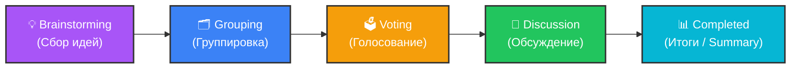
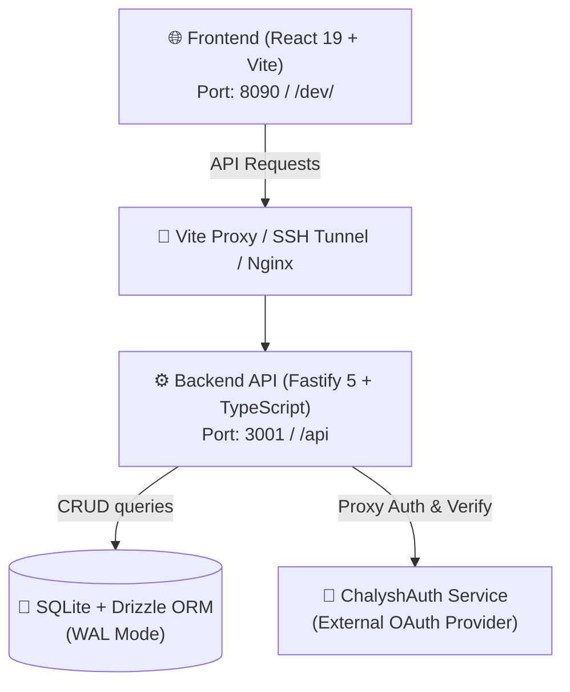

# 🚀 Retrospective Aggregator (Платформа для ретроспектив)

Современная веб-платформа для интерактивного проведения командных ретроспектив полного цикла: от сбора мнений и голосования до формирования, обсуждения и трекинга Action Items с возможностью удобного экспорта итогов.

---

## 📌 Содержание

- [Ключевые возможности](#-ключевые-возможности)
- [Стадии проведения ретроспективы](#-стадии-проведения-ретроспективы)
- [Архитектура и технологический стек](#-архитектура-и-технологический-стек)
- [Структура проекта](#-структура-проекта)
- [Структура базы данных](#-структура-базы-данных)
- [Быстрый старт (Локальная разработка)](#-быстрый-старт-локальная-разработка)
  - [Предварительные требования](#предварительные-требования)
  - [1. Настройка и запуск Backend](#1-настройка-и-запуск-backend)
  - [2. Настройка и запуск Frontend](#2-настройка-и-запуск-frontend)
- [Переменные окружения](#-переменные-окружения)
- [Production-развертывание](#-production-развертывание)
- [Документация и полезные ссылки](#-документация-и-полезные-ссылки)

---

## ✨ Ключевые возможности

### 🔐 Аутентификация и безопасность
- **Вход через Google OAuth** и **Telegram Widget** (проксируется через внешний сервис авторизации `ChalyshAuth`).
- Двухуровневая система JWT-токенов (`accessToken` + `refreshToken`) с автоматической ротацией.
- Запоминание целевого маршрута при неавторизованном входе для плавного редиректа после логина.

### 📋 Дашборд и управление комнатами
- Список активных и завершенных ретроспектив с фильтрацией и поиском.
- **Персональная статистика**: количество сессий, созданных карточек, отданных голосов и назначенных/завершенных задач.
- Создание ретроспективы по готовым шаблонам:
  - **Went Well / To Improve / Action Items** — классический формат анализа спринта.
  - **Mad / Sad / Glad** — срез эмоционального состояния команды.
  - **Start / Stop / Continue** — фокус на оптимизации рабочих процессов.
- Возможность редактирования названия комнат в реальном времени.
- Безопасное мягкое удаление комнат (*soft delete*) с модальным подтверждением.

### 💡 Интерактивная доска ретроспективы
- **Роли**: Разграничение возможностей участников и фасилитатора (создателя комнаты).
- **Анонимный режим**: Возможность скрывать авторство карточек для честной и открытой обратной связи.
- **Drag-and-Drop группировка**: Перемещение и сортировка карточек между колонками с помощью `@dnd-kit` с сохранением позиций в БД.
- **Интерактивное голосование**: Ограничение голосов (до 5 на участника), визуальный индикатор оставшихся голосов, автоматическая приоритизация карточек на этапе обсуждения.
- **Управление задачами (Action Items)**: Создание задач прямо внутри карточек, назначение ответственных из числа участников, отметка о выполнении.
- **Тред комментариев**: Добавление и удаление комментариев к задачам для обсуждения деталей реализации.

### 📊 Итоги и экспорт (Summary)
- Сводная страница результатов завершенного ретро: статистика активности, рейтинг обсуждаемых тем.
- Единый интерактивный чек-лист Action Items с фильтрами, статусами и возможностью оставлять комментарии к задачам.
- **Экспорт в 1 клик**: Генерация структурированного отчета в буфер обмена для **Markdown**, **Telegram** и **Slack**.

### 🎨 Дизайн и надежность интерфейса
- **Glassmorphism UI** на чистом Vanilla CSS с поддержкой **Dark** (по умолчанию) и **Light** тем оформления.
- Индикация сетевого статуса (оповещение об оффлайн-режиме) и периодический фоновый поллинг данных (10 сек).
- Защита от сбоев интерфейса через React `ErrorBoundary`.
- Система всплывающих уведомлений (Toast) и снекбар отмены удаления (Undo Snackbar).

---

## 🔄 Стадии проведения ретроспективы

Управление этапами встречи находится в руках фасилитатора:



| Стадия | Доступные действия |
|---|---|
| **Brainstorming** | Участники свободно создают карточки в колонках шаблона (публично или анонимно). |
| **Grouping** | Фасилитатор группирует карточки, перетаскивая их между колонками через Drag-and-Drop. |
| **Voting** | Команда голосует за наиболее важные карточки (лимит — 5 голосов на человека). |
| **Discussion** | Карточки автоматически сортируются по голосам; команда обсуждает их и создает Action Items с исполнителями. |
| **Completed** | Сессия завершена, переход к экрану сводных результатов, трекингу задач и экспорту отчетов. |

---

## 🏗️ Архитектура и технологический стек



### Frontend
- **Ядро**: React 19, TypeScript (~6.0), Vite 8
- **Маршрутизация**: React Router v7
- **Drag-and-Drop**: `@dnd-kit/core`, `@dnd-kit/sortable`, `@dnd-kit/utilities`
- **Иконки**: `lucide-react`
- **Стилизация**: Vanilla CSS + CSS Custom Properties, Glassmorphism, CSS-тултипы
- **Линтинг**: Oxlint

### Backend
- **Платформа**: Node.js 24 (ESM), TypeScript, `tsx`
- **HTTP-фреймворк**: Fastify 5
- **ORM и База данных**: Drizzle ORM, SQLite (`better-sqlite3` с режимом Write-Ahead Logging)
- **Валидация и схемы**: Zod, `fastify-type-provider-zod`
- **API Документация**: `@fastify/swagger` + `@fastify/swagger-ui` (OpenAPI/Swagger)
- **Аутентификация**: `@fastify/jwt`
- **Управление процессами**: PM2

---

## 📁 Структура проекта

```text
RetrospectiveAggregator/
├── backend/                  # Серверная часть (Fastify API)
│   ├── data/                 # Локальная база данных SQLite
│   ├── drizzle/              # Сгенерированные SQL-миграции
│   ├── src/
│   │   ├── config/           # Конфигурация переменных окружения
│   │   ├── db/               # Подключение к SQLite, схема Drizzle, раннер миграций
│   │   ├── modules/
│   │   │   ├── auth/         # Аутентификация, токены, интеграция с ChalyshAuth
│   │   │   └── rooms/        # Комнаты, карточки, голоса, задачи, комментарии, статистика
│   │   ├── plugins/          # Плагины Fastify (CORS, JWT, Swagger, Auth Middleware)
│   │   ├── app.ts            # Конфигурация приложения Fastify
│   │   └── server.ts         # Точка входа и запуск сервера
│   ├── drizzle.config.ts     # Конфигурация Drizzle Kit
│   ├── package.json
│   └── README.md
│
├── frontend/                 # Клиентская часть (React SPA)
│   ├── src/
│   │   ├── api/              # Клиент API для взаимодействия с бэкендом
│   │   ├── components/       # Переиспользуемые UI-компоненты (колонки, карточки, индикаторы)
│   │   ├── context/          # React-контексты (Auth, Theme, Toast, Offline)
│   │   ├── hooks/            # Пользовательские хуки (Telegram/Google Auth)
│   │   ├── pages/            # Страницы приложения (Login, Dashboard, Retro, Summary)
│   │   ├── routes/           # Конфигурация React Router
│   │   ├── App.tsx           # Корневой компонент с провайдерами
│   │   ├── index.css         # Глобальные стили, темы и дизайн-система
│   │   └── main.tsx          # Точка входа React
│   ├── vite.config.ts        # Конфигурация Vite и проксирования API
│   ├── package.json
│   └── README.md
│
├── docs/                     # Расширенная документация
│   └── flow_documentation.md # Архитектурные Mermaid-диаграммы и сценарии
├── CLAUDE.md                 # Правила разработки, кодстайл и версионирование
└── README.md                 # Главная документация проекта (текущий файл)
```

---

## 🗄️ Структура базы данных

База данных управляется через Drizzle ORM (`backend/src/db/schema.ts`):

- **`user_profiles`** — профили пользователей (привязка к `auth_user_id`, Telegram, Google, имя, аватар).
- **`retro_rooms`** — комнаты ретроспектив (название, шаблон, стадия, фасилитатор, флаг анонимности, мягкое удаление `deleted`).
- **`retro_participants`** — участники комнат и их роли (`facilitator` / `participant`).
- **`retro_cards`** — карточки заметок (колонка, текст, автор, порядок `position`, признак анонимности).
- **`retro_votes`** — голоса участников за карточки.
- **`retro_action_items`** — сформированные задачи (текст, ответственный исполнитель, статус выполнения `done`).
- **`retro_action_item_comments`** — комментарии к задачам для фиксации договоренностей.

---

## 🚀 Быстрый старт (Локальная разработка)

### Предварительные требования
- Установленный [NVM](https://github.com/nvm-sh/nvm) (Node Version Manager)
- Node.js версии `v24.x` (`.nvmrc` присутствует в подкаталогах)

### 1. Настройка и запуск Backend

```bash
# Перейдите в каталог бэкенда
cd backend

# Активируйте версию Node.js
nvm use

# Установите зависимости
npm install

# Создайте файл переменных окружения
cp .env.example .env
# Заполните JWT_SECRET и необходимые URL в .env

# Примените миграции базы данных SQLite
npm run db:migrate

# Запустите сервер разработки
npm run dev
```

- Сервер API будет доступен по адресу: `http://localhost:3001`
- Интерактивная документация Swagger UI: `http://localhost:3001/api/docs`

### 2. Настройка и запуск Frontend

В отдельном терминале:

```bash
# Перейдите в каталог фронтенда
cd frontend

# Активируйте версию Node.js
nvm use

# Установите зависимости
npm install

# Проверьте файл .env (при необходимости укажите VITE_GOOGLE_CLIENT_ID и VITE_TELEGRAM_BOT)
# Запустите dev-сервер Vite
npm run dev
```

- Клиентское приложение запустится по адресу: `http://localhost:8090/dev/`
- Запросы к `/dev/api/*` автоматически проксируются Vite на `http://localhost:3001/api/*`.

---

## ⚙️ Переменные окружения

### Backend (`backend/.env`)
| Переменная | Описание | По умолчанию / Пример |
|---|---|---|
| `PORT` | Порт Fastify сервера | `3001` |
| `BASE_URL` | Базовый префикс API | `/api` |
| `DATABASE_PATH` | Путь к файлу базы данных SQLite | `./data/retro_aggregator.db` |
| `AUTH_SERVICE_URL` | URL внешнего сервиса авторизации ChalyshAuth | `https://your-domain.com/auth/api` |
| `APP_URL` | URL фронтенд-приложения (для CORS) | `http://localhost:8090/dev` |
| `JWT_SECRET` | Секретный ключ для подписи и валидации JWT | *Строка не менее 16 символов* |
| `NODE_TLS_REJECT_UNAUTHORIZED` | Отключение проверки SSL-сертификатов (для локальной отладки) | `0` (опционально) |

### Frontend (`frontend/.env`)
| Переменная | Описание | Пример |
|---|---|---|
| `VITE_GOOGLE_CLIENT_ID` | Client ID для Google Identity Services | `xxx.apps.googleusercontent.com` |
| `VITE_TELEGRAM_BOT` | Имя Telegram-бота для авторизационного виджета | `ChalyshAuthBot` |
| `VITE_BASE_PATH` | Базовый путь для сборки/сервера (опционально) | `/dev/` или `/retrospective/` |

---

## 📦 Production-развертывание

### Сборка Frontend
Сборка компилирует TypeScript и оптимизирует ассеты через Vite с базовым путем `/retrospective/`:

```bash
cd frontend
npm run build
```
Готовая статика помещается в директорию `frontend/dist`.

### Запуск Backend через PM2
Бэкенд поддерживает фоновый запуск процесса через PM2:

```bash
cd backend
npm run build
npm run start:prod
```
Процесс будет зарегистрирован в PM2 с именем `RetroAggregator`.

### SSH-туннелирование для внешнего тестирования
Для тестирования авторизации через Telegram/Google на локальной машине настроен проброс порта:
```bash
cd frontend
npm run tunnel
```

---

## 📚 Документация и полезные ссылки

- [Mermaid Flow Documentation](./docs/flow_documentation.md) — блок-схемы переходов, сценариев группировки, голосования и связей данных.
- [Инструкции по бэкенду](./backend/README.md) — подробное руководство по работе с Fastify, Drizzle ORM и миграциями.
- [Инструкции по фронтенду](./frontend/README.md) — архитектура React-компонентов, контексты и стайлгайд.
- [Правила проекта и кодстайл](./CLAUDE.md) — стандарты кода, работа со стилями, версионирование и Git.
