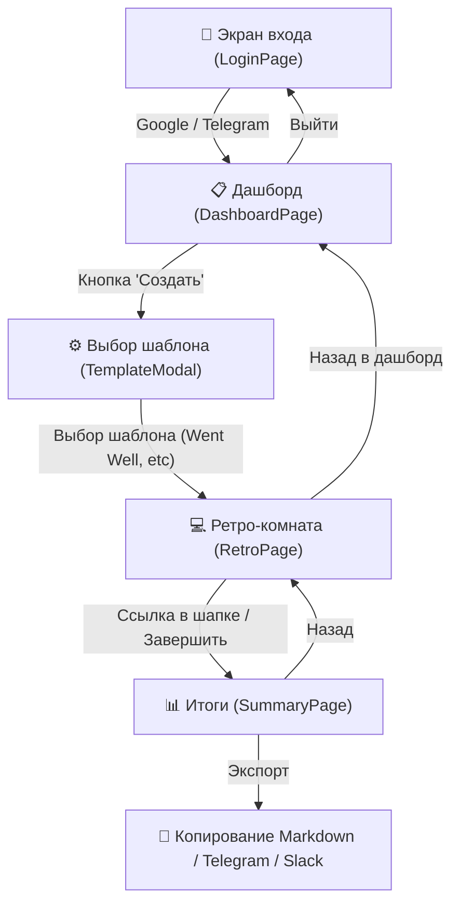
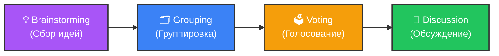
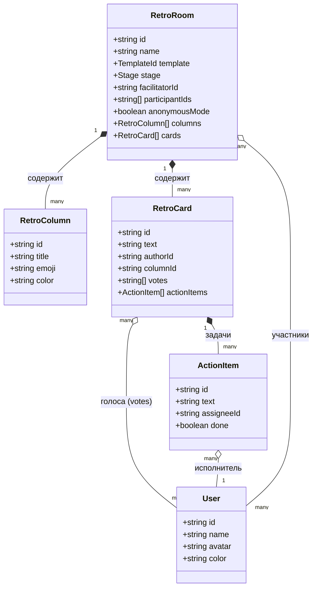
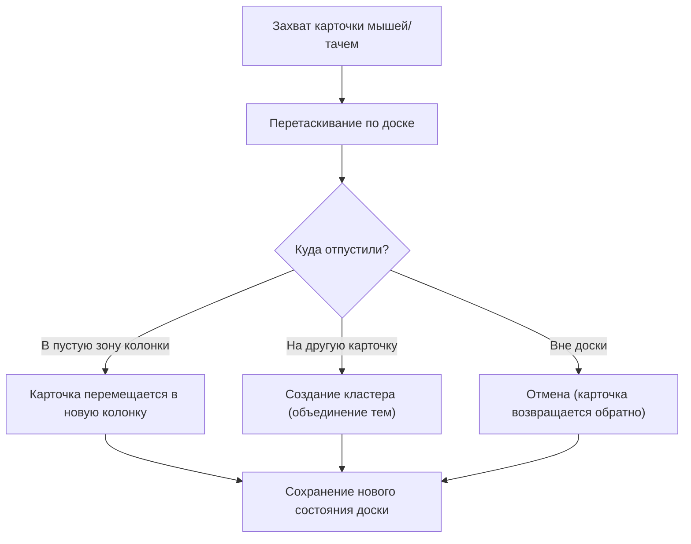
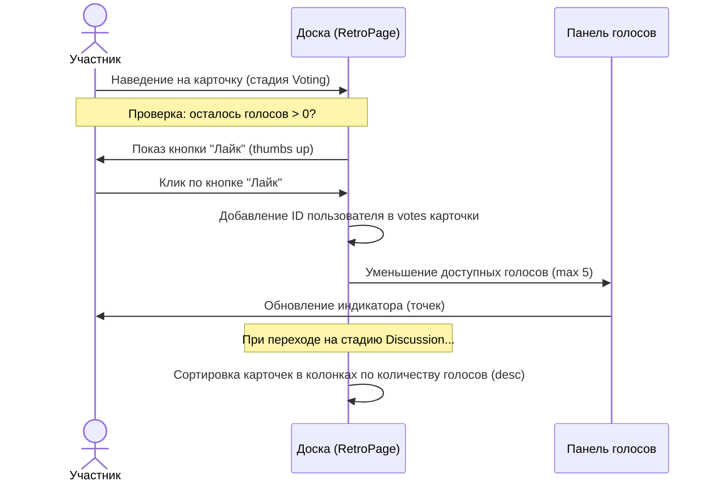
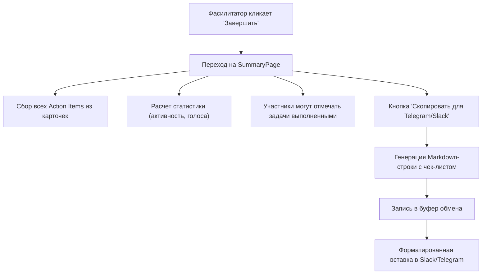

# 🔄 Документация пользовательских сценариев (User Flows & Architecture)

Этот документ содержит описание архитектуры интерфейса, переходов состояний и структуры данных MVP-версии платформы **RetroAggregator**.

---

## 1. Общая карта экранов и путей (Navigation Flow)

Диаграмма ниже показывает, как пользователь перемещается между экранами платформы от входа до экспорта результатов.

---

## 2. Стадии проведения ретроспективы (Stage Transitions)

Ретроспектива управляется фасилитатором (создателем комнаты). Переключение стадий изменяет доступные действия для всех участников сессии.

### Доступные действия на каждой стадии

| Стадия | Кто может переключить | Добавление карт | Смена колонок | Голосование | Action Items |
|---|---|---|---|---|---|
| **Brainstorming** | Фасилитатор | ✅ Да (все) | ❌ Нет | ❌ Нет | ❌ Нет |
| **Grouping** | Фасилитатор | ❌ Нет | ✅ Drag-n-Drop (все) | ❌ Нет | ❌ Нет |
| **Voting** | Фасилитатор | ❌ Нет | ❌ Нет | ✅ Да (лимит 5) | ❌ Нет |
| **Discussion** | Фасилитатор | ❌ Нет | ❌ Нет | ❌ Нет | ✅ Да (все) |

---

## 3. Схема данных (Data Model Relationships)

Интерфейс спроектирован на основе следующих типов данных:

---

## 4. Сценарий: Группировка карточек (Drag & Drop)

На стадии **Grouping** участники могут перетаскивать карточки. Движок DnD (реализованный на `@dnd-kit`) обрабатывает события перемещения:

---

## 5. Сценарий: Голосование и ранжирование (Voting & Sorting)

Процесс приоритизации тем перед обсуждением:

---

## 6. Сценарий: Генерация итогов и экспорт (Summary & Export)

Сценарий завершения встречи:

